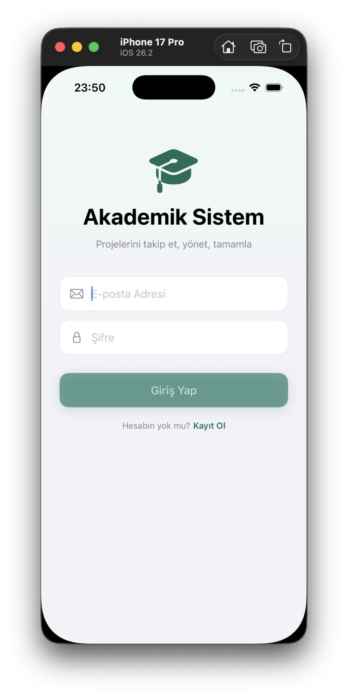
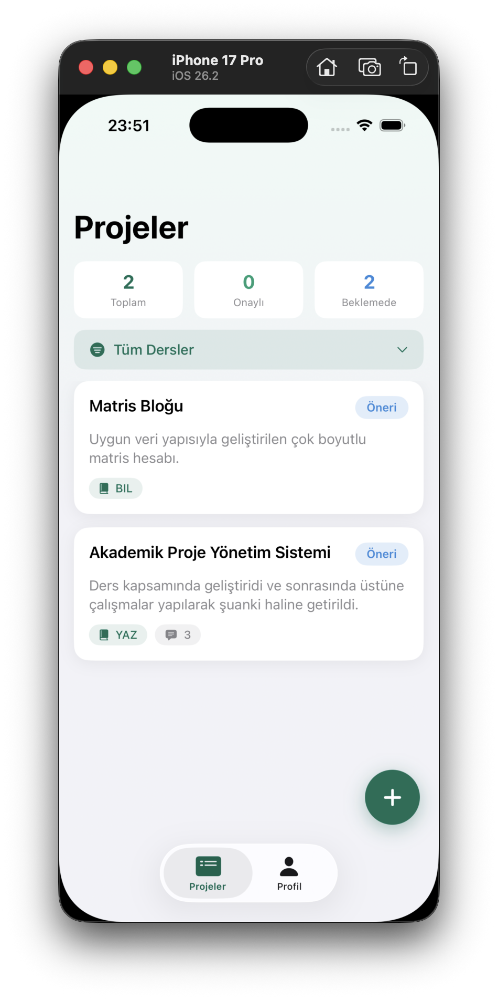

# Academic Project Management App

An iOS application for organizing and tracking academic course projects, built with SwiftUI and Firebase. The app introduces a role-based workflow where students propose projects, instructors approve or reject them, and administrators manage course records — mirroring how project supervision works in a real academic setting.

> This project started as an idea in a Database Management Systems course and grew into a personal initiative to deepen my command of Swift, SwiftUI, and cloud-backed mobile architecture.

---

## Screenshots

<p align="center">
  
  
</p>

<!-- Replace the placeholders above with real screenshots, e.g.:
|  |  | ... |
-->

---

## Features

The app is built around three user roles, each with its own capabilities.

### Student (roleId 3)
- Register a new account (signs in automatically after registration)
- Browse all projects with color-coded status badges
- Create new project proposals
- Edit and delete their own projects (owner-only, via long-press context menu)

### Instructor (roleId 2)
- Dedicated approvals screen listing all pending proposals
- Approve or reject student projects, updating their status in real time

### Administrator (roleId 1)
- Course management panel to create new course records from within the app
- View all existing courses

---

## Tech Stack

- **Language:** Swift
- **UI:** SwiftUI
- **Architecture:** MVVM (Model–View–ViewModel)
- **Authentication:** Firebase Authentication (email/password)
- **Database:** Cloud Firestore
- **IDE:** Xcode

---

## Architecture

The app follows the MVVM pattern. Views observe ViewModels, which hold state and talk to Firebase; Models are `Codable` structs that map directly to Firestore documents.

```
AcademicProject/
├── Models/          # Codable data structures (User, Project, Course, Department)
├── ViewModels/      # @MainActor ObservableObjects (Auth, Project, Course, ProjectDetail)
├── Views/           # SwiftUI screens
└── AcademicProjectApp.swift
```

### Data Models
- **User** — id (linked to Firebase Auth uid), fullName, email, roleId, departmentId
- **Project** — title, summary, status, courseId, createdBy
- **Course** — courseCode, courseName, term, departmentId, instructorId
- **Department** — department metadata

### Core Flow
On launch, the app checks for an existing session. Authenticated users land on a tab bar whose tabs adapt to their role; unauthenticated users see the login screen. New users can register from the login screen, which creates a Firebase Auth identity and a matching Firestore profile keyed by the same uid.

The project lifecycle is the heart of the app: a student submits a proposal (`status: proposal`), an instructor reviews it and sets the status to `approved` or `rejected`, and the change is reflected immediately across the app.

---

## Getting Started

### Prerequisites
- Xcode 15 or later
- An iOS 17+ simulator or device
- A Firebase project

### Setup
1. Clone the repository:
   ```bash
   git clone https://github.com/CanerCakal/AcademicProjectAppwithSwift.git
   ```
2. Create a project in the [Firebase Console](https://console.firebase.google.com).
3. Enable **Authentication** (Email/Password provider) and **Cloud Firestore**.
4. Download your `GoogleService-Info.plist` and add it to the Xcode project.
5. Add the Firebase SDK via Swift Package Manager (FirebaseAuth and FirebaseFirestore).
6. Set your Firestore security rules to allow authenticated access:
   ```
   rules_version = '2';
   service cloud.firestore {
     match /databases/{database}/documents {
       match /{document=**} {
         allow read, write: if request.auth != null;
       }
     }
   }
   ```
7. Build and run.

> **Note:** New accounts are created with the Student role by default. To test instructor or admin features, update the user's `roleId` in the Firestore console (`2` for instructor, `1` for admin).

---

## Roadmap

Planned improvements to bring the app closer to a production-grade product:

- [ ] In-app role management (admin promotes users to instructor)
- [ ] Fine-grained Firestore security rules (per-role, per-document access)
- [ ] Course selection when creating a project
- [ ] Project detail enhancements and richer status workflow
- [ ] Input validation and improved error handling
- [ ] Unit and UI tests

---

## License

This project is licensed under the MIT License — see the [LICENSE](LICENSE) file for details.
